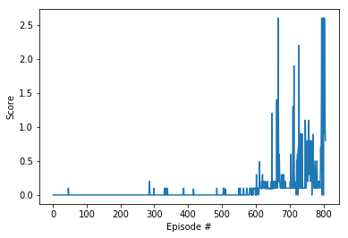

[//]: # (Image References)

[image1]: https://github.com/ekaakurniawan/DRLND/blob/master/p3_collab-compet/results/gif/01.gif

# Project 3: Collaboration And Competition

### Introduction

For this project, you will work with the [Tennis](https://github.com/Unity-Technologies/ml-agents/blob/master/docs/Learning-Environment-Examples.md#tennis) environment.

![Trained Agent][image1]

In this environment, two agents control rackets to bounce a ball over a net. If an agent hits the ball over the net, it receives a reward of +0.1.  If an agent lets a ball hit the ground or hits the ball out of bounds, it receives a reward of -0.01.  Thus, the goal of each agent is to keep the ball in play.

The observation space consists of 8 variables corresponding to the position and velocity of the ball and racket. Each agent receives its own, local observation.  Two continuous actions are available, corresponding to movement toward (or away from) the net, and jumping. 

The task is episodic, and in order to solve the environment, your agents must get an average score of +0.5 (over 100 consecutive episodes, after taking the maximum over both agents). Specifically,

- After each episode, we add up the rewards that each agent received (without discounting), to get a score for each agent. This yields 2 (potentially different) scores. We then take the maximum of these 2 scores.
- This yields a single **score** for each episode.

The environment is considered solved, when the average (over 100 episodes) of those **scores** is at least +0.5.

### Setup Python Environment

Please follow the instruction to [setup Python environment](https://github.com/udacity/deep-reinforcement-learning#dependencies) from the original course GitHub repository.

### Getting Started

1. Download the environment from one of the links below.  You need only select the environment that matches your operating system:
    - Linux: [click here](https://s3-us-west-1.amazonaws.com/udacity-drlnd/P3/Tennis/Tennis_Linux.zip)
    - Mac OSX: [click here](https://s3-us-west-1.amazonaws.com/udacity-drlnd/P3/Tennis/Tennis.app.zip)
    - Windows (32-bit): [click here](https://s3-us-west-1.amazonaws.com/udacity-drlnd/P3/Tennis/Tennis_Windows_x86.zip)
    - Windows (64-bit): [click here](https://s3-us-west-1.amazonaws.com/udacity-drlnd/P3/Tennis/Tennis_Windows_x86_64.zip)
    
    (_For Windows users_) Check out [this link](https://support.microsoft.com/en-us/help/827218/how-to-determine-whether-a-computer-is-running-a-32-bit-version-or-64) if you need help with determining if your computer is running a 32-bit version or 64-bit version of the Windows operating system.

    (_For AWS_) If you'd like to train the agent on AWS (and have not [enabled a virtual screen](https://github.com/Unity-Technologies/ml-agents/blob/master/docs/Training-on-Amazon-Web-Service.md)), then please use [this link](https://s3-us-west-1.amazonaws.com/udacity-drlnd/P3/Tennis/Tennis_Linux_NoVis.zip) to obtain the "headless" version of the environment.  You will **not** be able to watch the agent without enabling a virtual screen, but you will be able to train the agent.  (_To watch the agent, you should follow the instructions to [enable a virtual screen](https://github.com/Unity-Technologies/ml-agents/blob/master/docs/Training-on-Amazon-Web-Service.md), and then download the environment for the **Linux** operating system above._)

2. Place the file in the DRLND GitHub repository, in the `p3_collab-compet/` folder, and unzip (or decompress) the file. 
### Dependencies

To set up your python environment to run the code in this repository, follow the instructions below.

1. Create (and activate) a new environment with Python 3.6.

	- __Linux__ or __Mac__: 
	```bash
	conda create --name drlnd python=3.6
	source activate drlnd
	```
	- __Windows__: 
	```bash
	conda create --name drlnd python=3.6 
	activate drlnd
	```
	
2. Follow the instructions in [this repository](https://github.com/openai/gym) to perform a minimal install of OpenAI gym.  
	- Next, install the **classic control** environment group by following the instructions [here](https://github.com/openai/gym#classic-control).
	- Then, install the **box2d** environment group by following the instructions [here](https://github.com/openai/gym#box2d).
	
3. Clone the repository (if you haven't already!), and navigate to the `python/` folder.  Then, install several dependencies.
```bash
git clone https://github.com/udacity/deep-reinforcement-learning.git
cd deep-reinforcement-learning/python
pip install .
```

4. Create an [IPython kernel](http://ipython.readthedocs.io/en/stable/install/kernel_install.html) for the `drlnd` environment.  
```bash
python -m ipykernel install --user --name drlnd --display-name "drlnd"
```
5. Before running code in a notebook, change the kernel to match the `drlnd` environment by using the drop-down `Kernel` menu. 

### Core Files in this Repo
- `ddpg_agent.py`: adapted the original code from lessons
- `model.py`: modified NN strucutre: included batch normalization layer and added one more hidden layer to Actor
- `actor.pth`: saved model weights for the Actor
- `critic.pth`: saved model weights for the Critic
- `Tennis.ipynb`: notebook containing the solution and the plot of scores

### Instructions to run the code

- To replicate the result, after setting up the environment as instructed in Dependencies section, you can run the notebook `Tennis.ipynb` step by step. The notebook allows you to determine the number of episodes to run and maximum timesteps in each episode by passing them into the `ddqp` fucntion defined in part 3 of the notebook.

- To tweak the models, you can either go to the `ddpg_agent.py` or the `model.py` file.
    -  In `ddpg_agent.py`, you can tune the following hyperparamters: 
        - BUFFER_SIZE = int(1e6)  # replay buffer size
        - BATCH_SIZE = 256        # minibatch size
        - GAMMA = 0.99            # discount factor
        - TAU = 1e-3              # for soft update of target parameters
        - LR_ACTOR = 1e-3         # learning rate of the actor 
        - LR_CRITIC = 1e-3        # learning rate of the critic
        - WEIGHT_DECAY = 0        # L2 weight decay
        - LEARN_EVERY = 5         # learning timestep interval
        - LEARN_NUM = 10          # number of learning passes
        - GRAD_CLIPPING = 1.0     # gradient clipping
        - EPSILON = 1.0           # initial epsilon of the random noise
        - EPSILON_DECAY = 1e-6    # decay of the random noise
    - In `model.py`, you can modify the NN structure by editing the `Actor` and `Critic` classes.
    
- To watch the trained smart agent, load the weights from `actor.pth` and `critic.pth` and run 

### Result

The model solved the problem with around 800 episodes. 


