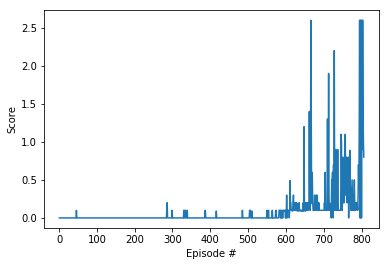

## Implementation

### Algo used: Deep Deterministic Policy Gradient (DDPG)

This project implements **Deep Deterministic Policy Gradient** and described in the paper [Continuous control with deep reinforcement learning](https://arxiv.org/abs/1509.02971). 

> We adapt the ideas underlying the success of Deep Q-Learning to the continuous action domain. We present an actor-critic, model-free algorithm based on the deterministic policy gradient that can operate over continuous action spaces. Using the same learning algorithm, network architecture and hyper-parameters, our algorithm robustly solves more than 20 simulated physics tasks, including classic problems such as cartpole swing-up, dexterous manipulation, legged locomotion and car driving. Our algorithm is able to find policies whose performance is competitive with those found by a planning algorithm with full access to the dynamics of the domain and its derivatives. We further demonstrate that for many of the tasks the algorithm can learn policies end-to-end: directly from raw pixel inputs.

DDPG concurrently learns a Q-function and a policy. More details can be found [here](https://spinningup.openai.com/en/latest/algorithms/ddpg.html).

The algo can be summarized with the pseudocode below


### Code Structure

The implementation mainly lies in the following three files
- `Tennis.ipynb` : The notebook instantiate the agent defined in ther other two scripts and contains the scores result

- `model.py` : Implementation of the **Actor** and the **Critic** classes.
    - The Actor and Critic classes each implements a *Target* and a *Local* Neural Networks used for the training.
    
- `ddpg_agent.py` : Implement the **DDPG agent** and a **Replay Buffer memory** used by the DDPG agent.
    - Compared to the lesson sample code, added support for multi-agent, specifically in `(self, states, actions, rewards, next_states, dones)`, also added support for multiple updates every 20 timesteps 
    - The Actor's *Local* and *Target* neural networks, and the Critic's *Local* and *Target* neural networks are instanciated by the Agent's constructor
    - The `learn()` method updates the policy and value parameters using given batch of experience tuples.
        ```
        Q_targets = r + γ * critic_target(next_state, actor_target(next_state))
        where:
            actor_target(state) -> action
            critic_target(state, action) -> Q-value
        ```

### Parameter Search and the Result

- Batch normalization improved the agent's performance a bit although it was not used the original paper.
- I added one additional hidden layer to the **Actor** provided in lessons. I didn't include more layers as the problem space is not that complex.
- Learn 10 times every 5 timesteps.
- Added decay to the OU noise so we can achieve better performance when we are more confident about our policy. 
- Set learning rate to 1e-3 to allow the agent learn fast enough.

#### DDPG parameters

The final version of my DDPG agent uses the following parameters values (These parameters are passed in the main training function `ddpg(...)` defined and called in the notebook.)

```
BUFFER_SIZE = int(1e6)  # replay buffer size
BATCH_SIZE = 256        # minibatch size
GAMMA = 0.99            # discount factor
TAU = 1e-3              # for soft update of target parameters
LR_ACTOR = 1e-3         # learning rate of the actor 
LR_CRITIC = 1e-3        # learning rate of the critic
WEIGHT_DECAY = 0        # L2 weight decayf the critic
LEARN_EVERY = 5         # learning timestep interval
LEARN_NUM = 10          # number of learning passes
GRAD_CLIPPING = 1.0     # gradient clipping
EPSILON = 1.0           # initial epsilon of the random noise
EPSILON_DECAY = 1e-6    # decay of the random noise
```

**Actor** NN has the following structure :

```
Input nodes (33) -> Fully Connected Layer (400 nodes, Relu activation) -> Batch Normlization -> Fully Connected Layer (300 nodes, Relu activation) -> Ouput nodes (4 nodes, tanh activation)
```


**Critic** NN has the following structure :

```
Input nodes (33) -> Fully Connected Layer (400 nodes, Relu activation) -> Batch Normlization-> Include Actions at the second fully connected layer -> Fully Connected Layer (300+4 nodes, Relu activation) -> Ouput node (1 node, no activation)
```
            
#### The Result

The trained agent is able to solve the problem in around 800 episodes.



## Future Plans
- Play with PPO, A3C, and D4PG to see if they produce more pleasing results.
- Better encapsule the code so that we can change the learning frequency and neural network structure more easily.
- Improve DDPG with prioritized experience replay
